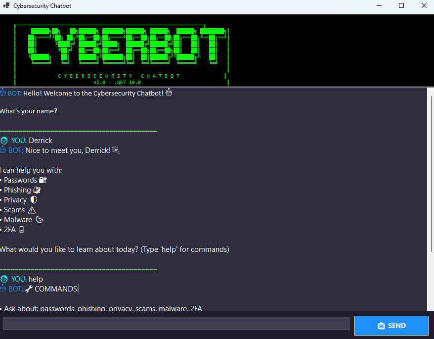

# 🛡️ Cybersecurity Chatbot - Part 2

 <p align="center">
  
</p>


## Student Information
- **Name:** Derrick Kapa
- **Course:** PROG6221 Programming 2A
- **Project:** Part 2 - WinForms GUI Chatbot

## Features Implemented

### ✅ GUI Design 
- WinForms application with dark theme (#1E1E2E)
- ASCII art header in green monospace font
- Scrollable chat display with colored messages
- Send button + Enter key support

### ✅ Keyword Recognition 
- 6 cybersecurity topics: passwords, phishing, privacy, scams, malware, 2FA
- Each keyword has 4 random responses
- Uses Dictionary for efficient lookup

### ✅ Random Responses 
- Lists/arrays for each keyword
- Random selection using Random class

### ✅ Conversation Flow 
- Handles "tell me more", "explain more", "another tip"
- Maintains topic context without resetting

### ✅ Memory & Recall 
- Remembers user name throughout session
- Remembers favorite topic when user says "I'm interested in X"
- Personalized responses using stored info

### ✅ Sentiment Detection 
- Detects: Worried, Curious, Frustrated, Happy
- Empathetic responses with automatic tips (no second input needed)

### ✅ Error Handling
- Fallback responses for unrecognized input
- No crashes on empty input or unknown text

### ✅ Code Optimization 
- 5 OOP classes (Form1, ChatBot, KeywordResponder, SentimentDetector, MemoryStore)
- Dictionaries for keyword responses and sentiment triggers
- No God class - UI separated from logic

## How to Run

### Prerequisites
- Visual Studio 2022 or later
- .NET 10.0 SDK
- Windows OS

### Steps
1. Clone the repository:
   ```bash
   git clone https://github.com/Derrick121K/CybersecurityChatbot_part2.git
   
## 🎥 Demo Video
[](https://youtu.be/2XG-eJhZgfI)

## CI/CD Status
[](https://github.com/Derrick121K/CybersecurityChatbot_part2/actions/workflows/dotnet.yml)

