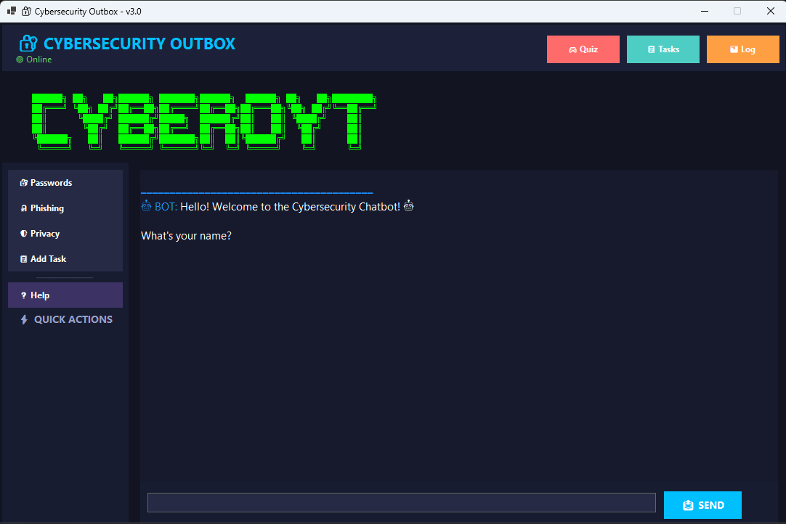
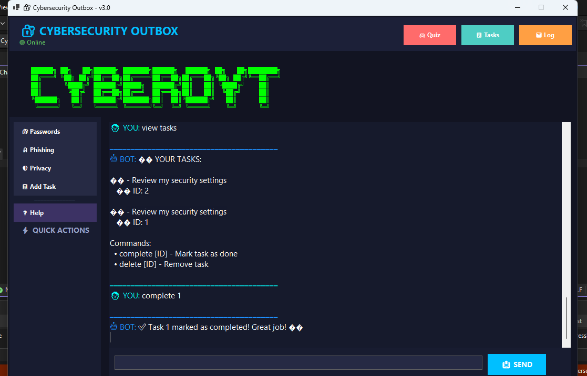

# 🛡️ Cybersecurity Outbox - POE Parts 1, 2 & 3


## Student Information

| Detail             | Information                                             |
| ------------------ | ------------------------------------------------------- |
| **Name**           | Derrick Kapa                                            |
| **Student Number** | ST10445255                                              |
| **Course**         | PROG6221 Programming 2A                                 |
| **Assessment**     | Portfolio of Evidence                                   |
| **Project**        | Cybersecurity Outbox                                    |
| **Repository**     | https://github.com/Derrick121K/CybersecurityChatbot_POE |

---

## Project Overview



**Cybersecurity Outbox** is a C# Windows Forms chatbot application created for the PROG6221 Programming 2A Portfolio of Evidence.

The application teaches users about important cybersecurity topics through an interactive chatbot interface. It includes keyword recognition, random responses, conversation memory, sentiment detection, task management, a cybersecurity quiz, NLP simulation, activity logging, and JSON-based storage.

This project combines the requirements from **Part 1, Part 2, and Part 3** into one complete application.

---

## Features Implemented

### Part 1: Chatbot Foundation

| Feature                | Description                                        |
| ---------------------- | -------------------------------------------------- |
| **Voice Greeting**     | Plays `greeting.wav` when the application starts   |
| **ASCII Art**          | Displays a cybersecurity-themed logo               |
| **Basic Chatbot Flow** | Introduces the chatbot and starts user interaction |

---

### Part 2: WinForms GUI and Chatbot Core

| Feature                 | Description                                                                                |
| ----------------------- | ------------------------------------------------------------------------------------------ |
| **GUI Design**          | Windows Forms interface with a dark theme, chat area, input box, and send button           |
| **Keyword Recognition** | Detects cybersecurity topics such as passwords, phishing, privacy, scams, malware, and 2FA |
| **Random Responses**    | Uses multiple responses per topic to make the chatbot feel more natural                    |
| **Conversation Flow**   | Supports follow-up phrases such as `tell me more`, `explain more`, and `another tip`       |
| **Memory and Recall**   | Remembers the user's name and favourite cybersecurity topic                                |
| **Sentiment Detection** | Detects moods such as worried, curious, frustrated, and happy                              |
| **Error Handling**      | Handles empty input, unknown messages, and invalid commands                                |
| **Code Optimization**   | Uses separate classes to keep the program organised and maintainable                       |

---

### Part 3: Advanced Chatbot Features

| Feature                | Description                                                                 |
| ---------------------- | --------------------------------------------------------------------------- |
| **Task Assistant**     | Allows users to add, view, complete, and delete cybersecurity-related tasks |
| **Cybersecurity Quiz** | Includes 11 quiz questions with score tracking and explanations             |
| **NLP Simulation**     | Detects user intent from natural language commands                          |
| **Activity Log**       | Tracks recent chatbot actions with timestamps                               |
| **JSON Storage**       | Saves tasks and activity logs locally using `Newtonsoft.Json`               |

---

## Main Commands

### General Commands

| Command         | Purpose                              |
| --------------- | ------------------------------------ |
| `help`          | Shows all available chatbot commands |
| `tutorial`      | Shows a step-by-step guide           |
| `exit` or `bye` | Ends the conversation                |

---

### Cybersecurity Topic Commands

| Example Command           | Purpose                                    |
| ------------------------- | ------------------------------------------ |
| `tell me about passwords` | Gives password safety tips                 |
| `tell me about phishing`  | Gives phishing protection advice           |
| `tell me about privacy`   | Gives privacy protection tips              |
| `tell me about scams`     | Gives scam awareness advice                |
| `tell me about malware`   | Gives malware protection tips              |
| `tell me about 2FA`       | Explains two-factor authentication         |
| `tell me more`            | Gives another tip about the previous topic |

---

### Task Assistant Commands

| Command                              | Purpose                         |
| ------------------------------------ | ------------------------------- |
| `add task - Review privacy settings` | Adds a new task                 |
| `view tasks`                         | Shows all pending tasks         |
| `complete 1`                         | Marks task number 1 as complete |
| `delete 1`                           | Deletes task number 1           |

---

### Quiz Commands

| Command               | Purpose                       |
| --------------------- | ----------------------------- |
| `start quiz`          | Starts the cybersecurity quiz |
| `A`, `B`, `C`, or `D` | Answers a quiz question       |

---

### Activity Log Command

| Command             | Purpose                          |
| ------------------- | -------------------------------- |
| `show activity log` | Displays recent chatbot activity |

---

## Project Structure

```text
CybersecurityChatbot_POE/
├── .github/workflows/
│   └── dotnet.yml
├── ChatBot.cs
├── CybersecurityChatbot.csproj
├── CybersecurityChatbot.sln
├── DataStorage.cs
├── Form1.cs
├── Form1.Designer.cs
├── Form1.resx
├── KeywordResponder.cs
├── MemoryStore.cs
├── Models.cs
├── NLPProcessor.cs
├── Program.cs
├── QuizManager.cs
├── SentimentDetector.cs
├── TaskManager.cs
├── greeting.wav
├── POE_screenshot1.png
├── POE_screenshot2.png
├── README.md
└── .gitignore
```

> `app_data.json` is created automatically when the program runs. It should not be committed to GitHub because it stores local task and activity data.

---

## Class Descriptions

| File                   | Purpose                                                                   |
| ---------------------- | ------------------------------------------------------------------------- |
| `Program.cs`           | Starts the Windows Forms application                                      |
| `Form1.cs`             | Handles the graphical user interface and user interaction                 |
| `ChatBot.cs`           | Processes user input and controls chatbot responses                       |
| `KeywordResponder.cs`  | Handles cybersecurity keyword detection and random responses              |
| `SentimentDetector.cs` | Detects the user's mood from their message                                |
| `MemoryStore.cs`       | Stores the user's name and favourite topic during the session             |
| `DataStorage.cs`       | Handles JSON saving and loading                                           |
| `TaskManager.cs`       | Manages task creation, viewing, completion, and deletion                  |
| `QuizManager.cs`       | Manages the cybersecurity quiz and score tracking                         |
| `NLPProcessor.cs`      | Detects user intent from natural language input                           |
| `Models.cs`            | Contains models for tasks, quiz questions, activity entries, and app data |

---

## Technologies Used

| Technology          | Purpose                                |
| ------------------- | -------------------------------------- |
| **C#**              | Main programming language              |
| **.NET 10.0**       | Application framework                  |
| **Windows Forms**   | Desktop graphical user interface       |
| **Newtonsoft.Json** | JSON serialization and deserialization |
| **Git**             | Version control                        |
| **GitHub**          | Repository hosting                     |
| **GitHub Actions**  | Continuous integration build workflow  |

---

## How to Run the Project

### Prerequisites

Make sure the following are installed:

* Windows OS
* Visual Studio 2022 or later
* .NET 10.0 SDK
* Internet connection for NuGet package restore

---

### Step 1: Clone the Repository

```bash
git clone https://github.com/Derrick121K/CybersecurityChatbot_POE.git
```

---

### Step 2: Open the Project Folder

```bash
cd CybersecurityChatbot_POE
```

---

### Step 3: Restore NuGet Packages

```bash
dotnet restore
```

---

### Step 4: Build the Project

```bash
dotnet build
```

---

### Step 5: Run the Application

```bash
dotnet run
```

You can also open `CybersecurityChatbot.sln` in Visual Studio and press `F5` to run the application.

---

## Screenshot



---

## Video Demonstration

Watch the project demonstration here:

[YouTube Demo](https://youtu.be/KcRhdvjQXQc)

---

## GitHub Repository

Repository link:

https://github.com/Derrick121K/CybersecurityChatbot_POE

---

## Project Checklist

* [x] Voice greeting added
* [x] ASCII art added
* [x] Windows Forms GUI created
* [x] Cybersecurity keyword recognition implemented
* [x] Random responses implemented
* [x] Conversation flow implemented
* [x] Memory and recall implemented
* [x] Sentiment detection implemented
* [x] Error handling implemented
* [x] Task assistant implemented
* [x] Cybersecurity quiz implemented
* [x] NLP simulation implemented
* [x] JSON storage implemented
* [x] Activity log implemented
* [x] GitHub Actions workflow added
* [x] Pull request created and merged
* [x] README documentation updated
* [x] Demo video added

---

## Marking Requirements Covered

| Requirement         | Status   |
| ------------------- | -------- |
| GUI design          | Complete |
| Keyword recognition | Complete |
| Random responses    | Complete |
| Conversation flow   | Complete |
| Memory and recall   | Complete |
| Sentiment detection | Complete |
| Error handling      | Complete |
| Code optimisation   | Complete |
| GitHub repository   | Complete |
| GitHub Actions      | Complete |
| Video demonstration | Complete |
| Final documentation | Complete |

---

## Author

**Derrick Kapa**
PROG6221 Programming 2A
GitHub: [Derrick121K](https://github.com/Derrick121K)

---

## Submission Information

| Detail                    | Information             |
| ------------------------- | ----------------------- |
| **Module**                | PROG6221                |
| **Assessment**            | Portfolio of Evidence   |
| **Submission**            | Part 3 Final Submission |
| **Submission Date**       | June 2026               |
| **Repository Visibility** | Public                  |

---

## License

This project was created for educational purposes as part of the PROG6221 Programming 2A module.

---

## Final Note

Thank you for reviewing my Cybersecurity Outbox POE project.
